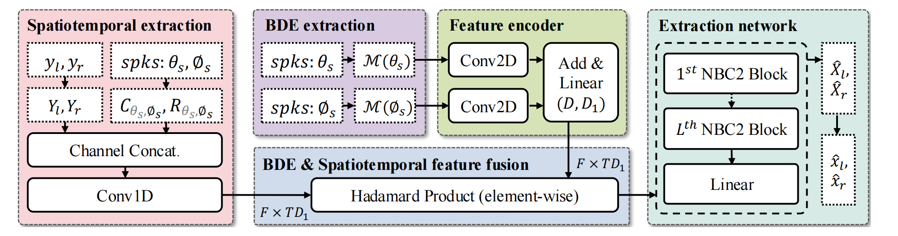
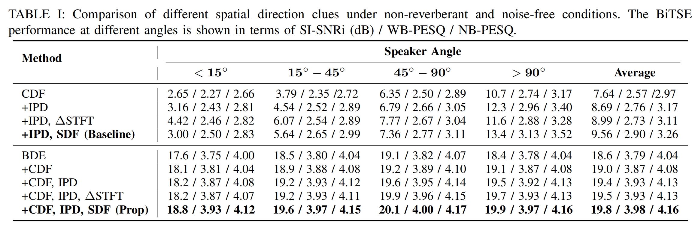
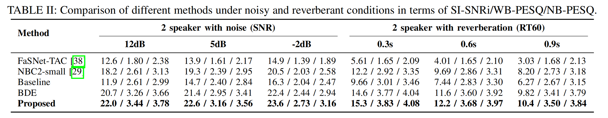

# Direction-based-BiTSE
This repository provides the implementation for the paper "Leveraging Boolean Directivity Embedding for Binaural Target Speaker Extraction" by Yichi Wang, Jie Zhang, Chengqian Jiang, Weitai Zhang, Zhongyi Ye, Lirong Dai.

# Dataset
We utilized the dataset generation method described in https://github.com/huangzj421/BinauralWSJ0Mix.

# BDE(Boolean Directivity Embedding) feature
The Boolean Directivity Embedding (BDE) feature is extracted within the `NBSS.py` script.

# Spatiotemporal features
In our previous work, "A Study of Multichannel Spatiotemporal Features and Knowledge Distillation on Robust Target Speaker Extraction" (available at https://ieeexplore.ieee.org/document/10446870), we proposed the spatiotemporal features CDF (Cosine directional function), SDF (Sine directional function), and ΔSTFT (delta Short-Time Fourier Transform). These features are extracted in the `spatial_fea.py` script.

# Model
For the backbone network, we used the NBC2 small available at https://github.com/audio-westlakeu/nbss.

#  Paradigm of the proposed BiTSE

# Results 

